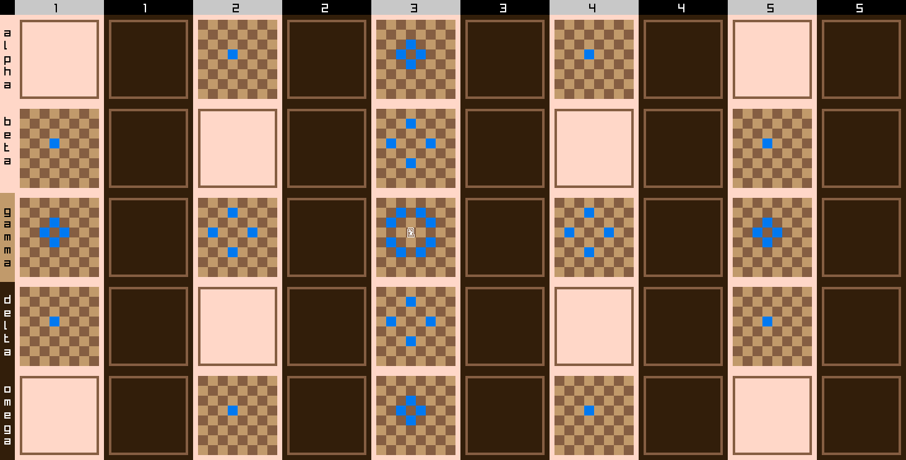
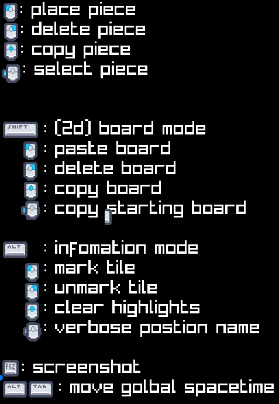

## finite 4d chess

My take on chess with multi dementional time travel.

## Play

(finite 4d chess.md)[finite 4d chess.md)]

shorten rules for those who plaied 5d chess

1. The extended dementions are 5x5
2. Kings are caputured
3. first to caputure 3 kings win
4. weakened queens
5. if no time travel has happened by turn 7, create a board using one of whites timeline

## state

minium vialable product, all manual controls(enjoy making your own house rules)